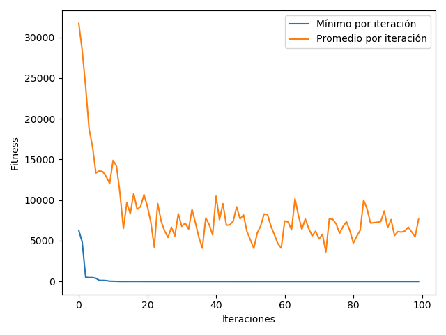
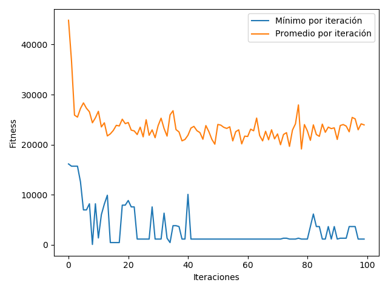
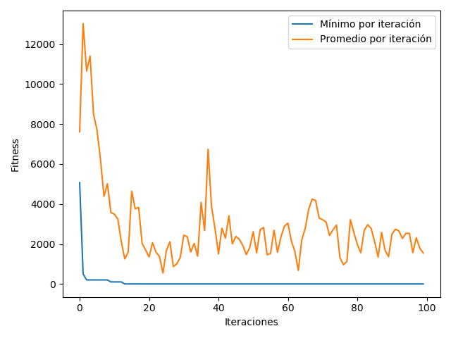

# Programación genética

Proyecto hecho para la tarea 3 del ramo _Redes Neuronales y Programación Genética_. Se crean árboles de operaciones que mediante algoritmos de evolución, se acercan a un número o ecuación determinada.

## Ejecución

Para ejecutar el programa, primero es necesario instalar sus requisistos. Esto se puede hacer desde esta misma carpeta, corriendo el comando

```
pip install requirements.txt
```

Luego, se pueden correr los experimentos con el siguiente comando:

```
python experiment.py -{tipo_gráfico} {tipo_problema}
```

`{tipo_gráfico}` puede ser _heatmap_ o _evolution\_graph_,  dependiendo del gráfico que se quiere generar.

`{tipo_problema}` puede ser _consider_depth_, _consider_repetitions_, _include_variables_, _symbolic_regression_ o _division_by_zero_. Cada una corresponde a una de las partes de la tarea, y los resultados se muestran en la siguiente sección.

## Resultados

Todos los problemas fueron modelados como problemas de minimización, ya que se busca minimizar la diferencia a un número, la profundidad de un árbol, las repeticiones, o las divisiones por 0. Por eso, para un individuo, mientras más bajo sea el fitness, mejor.

### Encontrar números

#### Sin límite de repeticiones

A continuación se muestra el gráfico para el primer problema. Este fue generado con una versión anterior del programa, pues la actual se cae por el crecimiento de los árboles.


En este caso el _fitness_ se mide como la diferencia absoluta entre la evaluación del árbol y el número que se buscaba. Se puede ver que este parámetro en general baja tanto en su promedio como en su mínimo, pero esto no es estable, si no que suben y bajan, lo que probablemente se debe a que las mutaciones pueden hacer que el árbol crezca mucho, y con ello, esta diferencia también (por ejemplo, al multiplicarse dos subárboles grandes).

#### Considerando la produndidad

Desde esta sección, sólo se incluyen los gráficos para el fitness mínimo y el promedio, debido a que el máximo puede ser tan grande que no permite ver los demás resultados. 



Como se puede ver, en este caso las mutaciones no hacen que el fitness suba tanto, ya que si un árbol crece mucho, es castigado.

#### Sin repetición de terminales

Para implementar esta parte, lo que se hizo fue castigar a los árboles que tenían repeticiones de terminales.


El gráfico se ve parecido al anterior, pero el mínimo a veces se pega saltos. Esto se debe probablemente debido a que, al mutar o cruzarse dos individuos, es bastante probable que un terminal se repita.

### Implementación de variables.

Para implementar variables, se hicieron cambios en la clase _TerminalNode_. Al evaluarse un nodo terminal que está almacenando un _string_, se busca el valor equivalente en el diccionario que se le pasa al método de evaluación, y se reemplaza por el valor correcto.



Para este caso, la prueba se hizo agregando una sola variable, `'x'`, que fue evaluada como 6 para el cálculo del fitness.

### Regresión Simbólica

Para esta parte se utilizó lo mismo que para la parte anterior. Para el cálculo del fitness, en vez de la diferencia a un número específico, se calculó la diferencia total al evaluar el árbol y la función original en el intervalo [-100, 100], de 1 en 1.

 

En este caso, se encuentran funciones equivalentes bastante rápido. Por ejemplo, para la función que sale en el enunciado: x^2+x-6, se encuentra la expresión (x + ((((x - x) - (0 * 2)) - ((-9 - -8) * (x * x))) - 6)), que es equivalente al ser simplificada. Más adelante, el algoritmo va generando otras expresiones equivalentes, pero más pequeñas, por la minimización de la profundidad del árbol

### División

El nodo se implementó de la misma manera que los demás nodos de la librería. Para manejar las divisiones por 0, se artrapa la excepción, y se devuelve en cambio un número muy grande. Esto es suficiente para que la función de fitness castigue a los árboles que están dividiendo por 0.

 

## Análisis


El heatmap anterior se generó con el problema de regresión simbólica, sin división por 0.

Se puede ver que en general, mientras más grande es la población, el algoritmo toma menos iteraciones en encontrar una solución. La mutación no parece afectar tanto el mejor caso, aunque su efecto se nota más en poblaciones pequeñas, cuando la mutación es más alta, pues en este caso, es problable que un individuo que se acerca a la población, mute de todas formas.